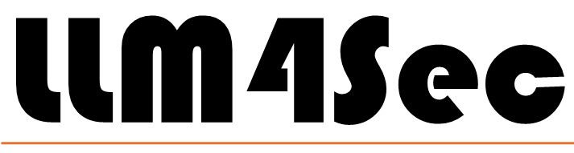
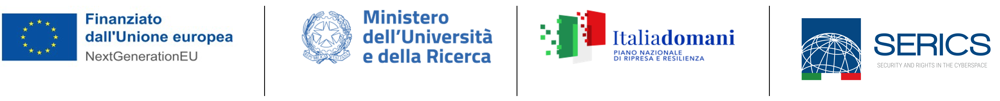

{: .box-note style="color: #212529"}
Please note, this is the 2025 edition of the LLM4Sec Workshop website, provided for archival purposes. For the most current edition, please click [here](https://checkmate-workshop.github.io).

{:style="text-align:center;"}
{:class="img-responsive" style="width: 70%; display:block; margin-right:auto; margin-left:auto;}

{: style="text-align: center"}
**November 13, 2025 - Washington DC, USA**

{:style="text-align:center;"}
{:style="width: 70%;}

{: style="text-align: center"}
The LLM4Sec workshop will be co-located with the\
[IEEE International Conference on Data Mining (ICDM) 2025](https://www3.cs.stonybrook.edu/~icdm2025/index.html){:target="_blank"}

{: style="text-align: center"}
Sponsored by

{:style="text-align:center;"}
{:style="width: 70%;}

---

- [2025 - Call For Papers](#call-for-papers)
- [2025 - Program](#program)
- [2025 - Organizers](#organizers)

---

# Call For Papers

## Important Dates

<table>
  <tbody>
    <tr style="background-color:#FFFFFF; color:#404040">
      <td>Paper Submission Deadline</td>
      <td>August 29, 2025</td>
      <td></td>
    </tr>
    <tr style="background-color:#FFFFFF; color:#404040">
      <td>Notification to authors</td>
      <td>September 15, 2025</td>
      <td>extended: September 18, 2025</td>
    </tr>
    <tr style="background-color:#FFFFFF; color:#404040">
      <td>Camera-ready versions</td>
      <td>September 25, 2025</td>
      <td>extended: October 5, 2025</td>
    </tr>
    <tr style="background-color:#FFFFFF; color:#404040">
      <td>Workshop date</td>
      <td>November 13, 2025</td>
      <td></td>
    </tr>
  </tbody>
</table>

{: style="text-align: justify"}
*Note*: _all deadlines are Anywhere On Earth (AOE) time_
{: style="text-align: justify"}
Submission site: [ https://ieeecps.org/cps/v2/auth/login?ak=1&pid=24XmCKZ1gAf1u24iyCTGnr]( https://ieeecps.org/cps/v2/auth/login?ak=1&pid=24XmCKZ1gAf1u24iyCTGnr){:target="_blank"}

## CFP
{: style="text-align: justify"}
Large Language Models (LLMs) are widely used for their exceptional ability in performing natural language processing applications like question answering, text completion, and text translation, to name a few. These capabilities enable their use in several domains such as customer support and interaction, content creation, editing and proofreading, sentiment analysis, etc. Besides the natural language, LLMs can generate and manipulate sequences of tokens of any kind, acting as boxes into which human knowledge can be compressed and then extracted when necessary. Owing to this, LLMs can be used to solve a wide range of problems and have been increasingly incorporated into several software frameworks. Among the others, their adoption to advance in the field of cyber security is gaining momentum. As a matter of fact, LLMs have been employed to expose and remediate security flaws, generate secure code and test cases, detect vulnerable or malicious code, and verify the integrity, confidentiality, and reliability of data. Interesting results have been presented so far, but the research in this area is still in its early stages, and it has the potential to produce further significant findings.

{: style="text-align: justify"}
This workshop aims to stimulate research on LLM-based solutions for security and privacy. We invite both academic and industrial researchers to submit research papers as either original works, discussion papers, or excerpt of published articles.

{: style="text-align: justify"}
Topics of interest include, but are not limited to:
{: style="text-align: justify"}
- Secure code generation
- Test case generation
- Vulnerable code detection
- Malicious code detection
- Vulnerable code fixing
- Software deobfuscation and repairing
- Anomaly-based detection
- Signature-based detection
- Network security
- Computer forensics
- Spam detection
- Phishing detection and prevention
- Vulnerability discovery
- Malware identification and analysis
- Data anonymization/de-anonymization
- Big data analytics for security
- Data integrity
- Data confidentiality
- Data reliability
- Data traceability
- Zero-day attack detection
- Automated security policy generation
- Predictive analytics
- Decision support

## Submission guidelines
{: style="text-align: justify"}
- Authors are invited to submit original papers that have not been published elsewhere and are not currently under consideration for another journal, conference, or workshop.
- Submissions must be a PDF file limited to a maximum of eight (8) pages (plus 2 extra pages for bibliography and any appendices) in the IEEE 2-column format ([https://www.ieee.org/conferences/publishing/templates.html](https://www.ieee.org/conferences/publishing/templates.html){:target="_blank"}), including the bibliography and any appendices. Submissions longer than 10 pages will be rejected without review. All submissions will be triple-blind reviewed by the Program Committee based on technical quality, relevance to the scope of the workshop, originality, significance, and clarity.
- Manuscripts must be submitted electronically through the online submission system: [https://ieeecps.org/cps/v2/auth/login?ak=1&pid=24XmCKZ1gAf1u24iyCTGnr](https://ieeecps.org/cps/v2/auth/login?ak=1&pid=24XmCKZ1gAf1u24iyCTGnr){:target="_blank"}
- Accepted papers will be included in the ICDM Workshop (ICDMW) proceedings (separate from ICDM Main Conference Proceedings), published by the IEEE Computer Society Press in IEEExplore and indexed in Scopus.
- At least one author of each accepted paper must complete the registration and present the paper at the workshop for it to be included in the proceedings and program. Registration link and fees can be found at [https://www3.cs.stonybrook.edu/~icdm2025/registration.html](https://www3.cs.stonybrook.edu/~icdm2025/registration.html){:target="_blank"}

---

# Program

## Accepted Papers

### Regular Papers
- _David Schwarzbeck, Daniela Novac, Michael Philippsen_ - Register Expansion and SemaCall: 2 low-overhead dynamic Watermarks suitable for Automation in LLVM
- _Sam Collins, Alex Poulopoulos, Marius Muench, Tom Chothia_ - Anti-Cheat: Attacks and the Effectiveness of Client-Side Defences
- _Thomas Faingnaert, Tianyi Zhang, Willem Van Iseghem, Gertjan Everaert, Bart Coppens, Christian Collberg, Bjorn De Sutter_ - Tools and Models for Software Reverse Engineering Research
- _Matti Schulze, Christian Lindenmeier, Jonas Röckl, Felix Freiling_ - IlluminaTEE: Effective Man-At-The-End Attacks from within ARM TrustZone
- _Sebastián R. Castro, Alvaro Cardenas_ - Ghost in the SAM: Stealthy, Robust, and Privileged Persistence through Invisible Accounts

### Short Papers
- _Thomas Faingnaert, Willem Van Iseghem, Bjorn De Sutter_ - K-Hunt++: Improved Dynamic Cryptographic Key Extraction

## Program
<table>
  <tbody>
   <tr style="background-color:#242526; color:#F4F4F4">
      <td>9:00</td>
      <td><b>Morning Session 1</b></td>
    </tr>
    <tr style="background-color:#18191a; color:#F4F4F4">
      <td>9:00 - 9:15</td>
      <td><i>Welcome Message</i></td>
    </tr>
    <tr style="background-color:#18191a; color:#F4F4F4">
      <td>9:15 - 9:35</td>
      <td>Register Expansion and SemaCall: 2 low-overhead dynamic Watermarks suitable for Automation in LLVM</td>
    </tr>
    <tr style="background-color:#18191a; color:#F4F4F4">
      <td>9:35 - 9:55</td>
      <td>IlluminaTEE: Effective Man-At-The-End Attacks from within ARM TrustZone</td>
    </tr>
    <tr style="background-color:#18191a; color:#F4F4F4">
      <td>9:55 - 10:10</td>
      <td>K-Hunt++: Improved Dynamic Cryptographic Key Extraction (short)</td>
    </tr>
    <tr style="background-color:#18191a; color:#F4F4F4">
      <td>10:10 - 11:00</td>
      <td><i>Coffee Break</i></td>
    </tr>
    <tr style="background-color:#242526; color:#F4F4F4">
      <td>11:00</td>
      <td><b>Morning Session 2</b></td>
    </tr>
    <tr style="background-color:#18191a; color:#F4F4F4">
      <td>11:00 - 11:20</td>
      <td>Anti-Cheat: Attacks and the Effectiveness of Client-Side Defences</td>
    </tr>
    <tr style="background-color:#18191a; color:#F4F4F4">
      <td>11:20 - 11:40</td>
      <td>Tools and Models for Software Reverse Engineering Research</td>
    </tr>
    <tr style="background-color:#18191a; color:#F4F4F4">
      <td>11:40 - 12:00</td>
      <td>Ghost in the SAM: Stealthy, Robust, and Privileged Persistence through Invisible Accounts</td>
    </tr>
    <tr style="background-color:#18191a; color:#F4F4F4">
      <td>12:00 - 12:10</td>
      <td><i>Closing Remarks</i></td>
    </tr>
  </tbody>
</table>

---

# Organizers

## Chairs

- **General Chair**: [Sebastian Schrittwieser](https://www.sba-research.org/team/sebastian-schrittwieser/){:target="_blank"}, _Faculty of Computer Science, University of Vienna, Austria_
- **Program Chair**: [Michele Ianni](https://iannim.github.io){:target="_blank"}, _University of Calabria, Italy_

## Steering Committee

- Sebastian Banescu, _Technical University of Munich, Germany_
- Sebastian Bardin, _CEA LIST, France_
- Tim Blazytko, _emproof, Germany_
- Christian Collberg, _University of Arizona, USA_
- Mila Dalla Preda, _University of Verona, Italy_
- Jack Davidson, _University of Virginia, USA_
- Bjorn De Sutter, _Ghent University, Belgium_
- Paolo Falcarin, _Ca' Foscari University of Venice, Italy_
- Roberto Giacobazzi, _University of Arizona, USA_
- Yuan Gu, _IRDETO, Canada_
- Christophe Hauser, _Dartmouth College, USA_
- Yonghwi Kwon, _University of Virginia, USA_
- Arun Lakhotia, _University of Louisiana, USA_
- Todd McDonald, _University of South Alabama, USA_
- Golden G. Richard III, _Louisiana State University, USA_
- Natalia Stakhanova, _University of Saskatchewan, Canada_
- Brecht Wyseur, _Kudelski IoT Security, Switzerland_

## Program Committee

- Mohse	Ahmadvand, _Quantstamp_
- Guillaume Bonfante, _Université de Lorraine, France_
- Mariano Ceccato, _University of Verona, Italy_
- Christoph Csallner, _University of Texas at Arlington, USA_
- Peter	Garba, _Thales Group_
- Claudia Greco, _University of Calabria, Italy_
- Peter	Kieseberg, _St. Pölten University of Applied Sciences, Austria_
- Patrick	Kochberger, _St. Pölten University of Applied Sciences, Austria_
- Caroline Lawitschka, _University of Vienna, Austria_
- Jean-Yves Marion, _Université de Lorraine, France_
- Mizuhito Ogawa, _Japan Advanced Institute of Science and Technology, Japan_
- Moritz Schloegel, _Ruhr-Universitaet Bochum, Germany_
- Janaka Senanayake, _Robert Gordon University, UK_
