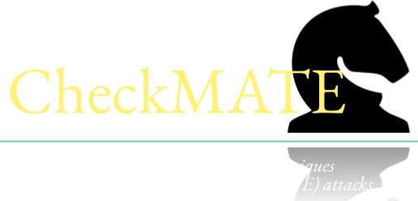

{:style="text-align:center;"}
{:class="img-responsive" style="width: 80%; display:block; margin-right:auto; margin-left:auto;}

<!--
{: style="text-align: center"}
## CheckMATE @ [ACM CCS 2024](https://www.sigsac.org/ccs/CCS2024/)

{: style="text-align: center"}
## Research on offensive and defensive techniques in the context of Man At The End (MATE) attacks
-->

{: style="text-align: justify"}
The CheckMATE workshop will be co-located with the [ACM Conference on Computer and Communications Security (CCS) 2024](https://www.sigsac.org/ccs/CCS2024/){:target="_blank"}

{: style="text-align: justify"}
MATE (Man-At-The-End) is an attacker model where an adversary has access to the target software and/or hardware environment of his victim and the ability to observe and modify it in order to extract sensitive information or secrets. This information could include cryptographic keys, configuration information, etc. Possible goals of an attack might include compromising code integrity, inserting backdoors, among many others. Typical examples of such scenarios are an attack on a stolen smartphone or against software leveraging protection to offer premium content and/or features such as paid TV channels.

{: style="text-align: justify"}
The main focus of CheckMATE is on new models and techniques to defend software from tampering, reverse engineering, and piracy as well as to the development of new attack strategies that highlight the need of more complete defenses.
