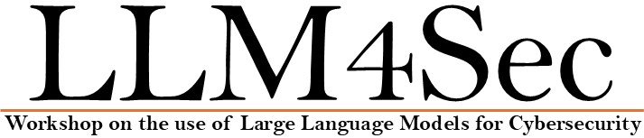

{:style="text-align:center;"}
{:class="img-responsive" style="width: 80%; display:block; margin-right:auto; margin-left:auto;}

{: style="text-align: center"}
**November 12, 2025 - Washington, USA**

<!--
{: style="text-align: center"}
## LLM4Sec @ [ICDM 2025](https://www3.cs.stonybrook.edu/~icdm2025/index.html)

{: style="text-align: center"}
## Workshop on the use of Large Language Models for Cybersecurity
-->

{:style="text-align:center;"}

{: style="text-align: center"}
The LLM4Sec workshop will be co-located with the\
[IEEE Intrnational Conference on Data Mining (ICDM) 2025](https://www3.cs.stonybrook.edu/~icdm2025/index.html){:target="_blank"}
